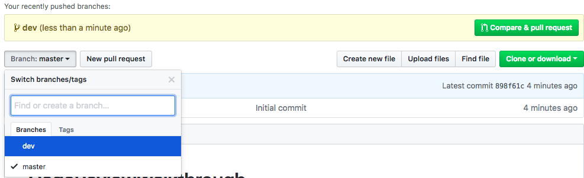
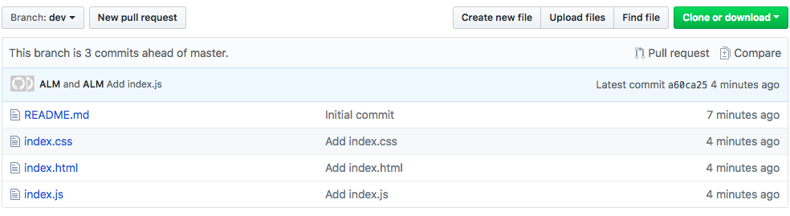
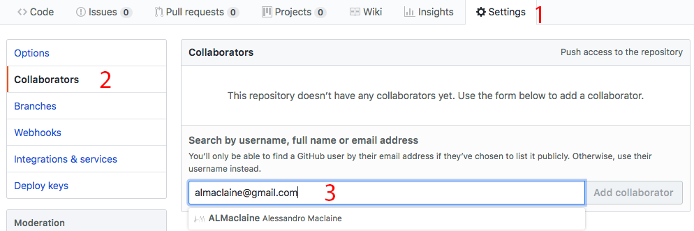
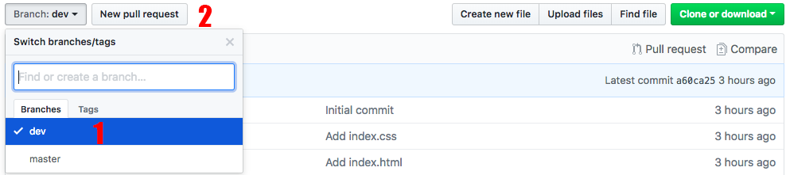
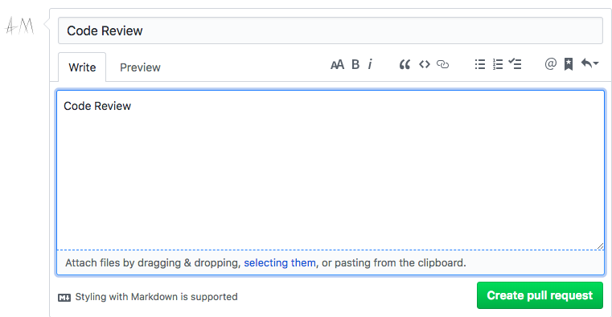

# code-review-new-project
Activity to teach how to create request a code review for a fresh repo.

## Overview
This activity will teach you how to create a code review for the master branch from this fresh repo.

## Steps

### Step 1 - Navigate To Folder
- Open your terminal and navigate to this repo.

### Step 2 - Add .gitignore

1. Write a simple .gitignore, here is a one liner to copy into the terminal.

```bash
echo ".DS_Store" > .gitignore
```

### Step 3 - Create Branch
- Crete your new dev branch using the following command. This will create a new branch called dev.

```bash
git branch dev
```

- You can see your new branch by typing.
```bash
git branch --list
```

- You enter or use the new branch by typing
```bash
git checkout dev
```

- You are now on the new branch dev, you can see this by listing them again
```bash
git branch --list
```

### Step 4 - Add index.html and make 1st commit

- Create an index.html file and fill it with some info.

```html
<!DOCTYPE html>
<html lang="en">
<head>
    <meta charset="UTF-8">
    <meta name="viewport">
    <title>Document</title>
</head>
<body>
    My first page.
</body>
</html>
```

- Make your first commit

```bash
git commit -am "Add index.html";
```

### Step 5 - Add index.css and commit

- Create index.css file and fill it with some styles.

```css
    .button {
        width: 100px;
        height: 100px;
    }
```

- Commit index.css

```bash
git commit -am "Add index.css";
```

### Step 6 - Add index.js and commit

- Create index.js file and will it with some dummy code

```javascript
var x = 1;
console.log(x);
```

- Commit index.js

```bash
git commit -am "Add index.js";
```

### Step 7 - Push up code to github

- We haven't officially pushed yet, so if you haven't push up your code.

```bash
git push;
```

- You'll see this doesn't work, this is because the branch isn't on github. To push the branch up to github type

```bash
git push --set-upstream origin dev
```

### Step 8 - Check your branches on github

- You should now be able to see your branches on github.



- When you select dev, all your dev files should show up.



### Step 9 - Add your TAs as collaborators

- After you've completed the above steps you must add your TA as a collaborator



1. Click On Settings
2. Click on collaborators
3. Type your TA's email and add them

### Step 10 - Make Pull Request from dev to master

1. Change to dev branch in drop down.
2. Click new pull request



### Step 11 - Write Pull Request Message

1. Write 'Code Review' in Title and Description



2. Click 'Create Pull Request'

### End
